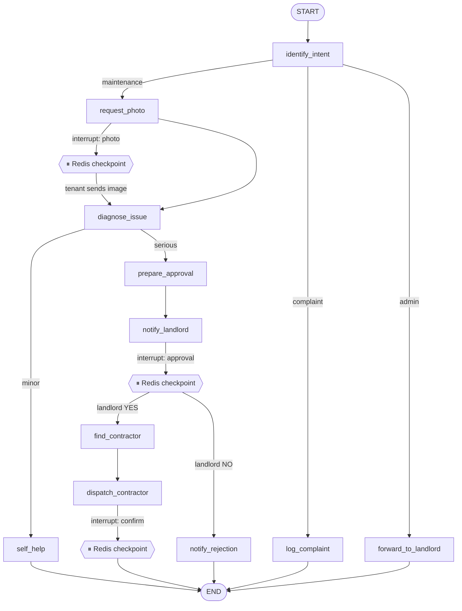

# LangGraph Maintenance Orchestration

## Graph visualization



## Architecture

| Layer | Responsibility |
|-------|----------------|
| `app/graph/builder.py` | LangGraph StateGraph definition |
| `app/nodes/` | One interaction step per node |
| `app/graph/orchestrator.py` | Event dispatch + interrupt/resume |
| `app/storage/redis_checkpoint.py` | Durable graph state |
| `app/services/claude_service.py` | Isolated LLM reasoning (Pydantic JSON) |
| `app/workers/timeout_worker.py` | Event-driven reminders/escalations |

## Local development

```bash
# 1. Install dependencies
uv sync

# 2. Configure environment
cp .env.example .env

# 3. Start infrastructure
docker-compose up -d postgres redis

# 4. Migrate + seed
uv run alembic upgrade head
uv run python seed_demo.py

# 5. Run API (starts timeout worker automatically)
uv run uvicorn app.main:app --reload --port 8000

# 6. Inspect workflow state
curl http://localhost:8000/api/v1/workflows/<tenant_phone>
```

## Design principles

- **LangGraph orchestrates** — Claude never decides the next node
- **One step per node** — no blocking loops
- **Redis checkpoints** — multi-turn resume across messages
- **interrupt()** — human-in-the-loop at photo, approval, contractor confirm
- **Timeouts** — Redis sorted-set scheduler (24h / 30min / 15min)

Generate PNG from Mermaid: paste the diagram into https://mermaid.live
